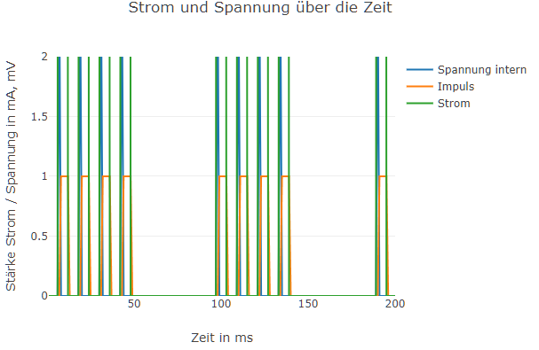

---

**Deep Learning**

**Dozent: Prof. Dr. Felix Gers (Berliner Hochschule für Technik)**

**Studiengang Medieninformatik Online MA, Sommersemester 2022**

**University of Applied Sciences Emden/Leer, Faculty of Technology, Department of Electrical Engineering and
Informatics**

---

### Einsendeaufgabe EA2 : Erstellung einer Webanwendung zur Simulation und Visualisierung eines Netzwerkes mit Spiking Neurons.

[zur Webseite](https://deep-learning.ckitte.de/ea2/)

## Umsetzung

Die hier vorgestellte Umsetzung der Aufgabenstellung teilt sich in zwei einzelne Lösungen. Bei der ersten Lösung handelt
es sich um eine konfigurierbare Simulation zweier verbundener LIF Neuronen. Die zweite Lösung beinhaltet eine Simulation
zum Verhalten des LIF Neurons innerhalb eines größeren Netzwerkes. Der gesamte Source Code ist frei
auf [GitHub](https://github.com/ChristianKitte/DeepLearningSpikingNeurons) verfügbar. Daher wird an dieser Stelle nicht
zu tief auf den Code eingegangen.

## Leaky Integrate and Fire (LIF) Neuron

Ein **Leaky Integrate and Fire (LIF) Neuron** zeichnet sich grundlegend dadurch aus, dass mit zunehmenden Signaleingang
ein Spannungspotential aufgebaut wird. Wird eine bestimmte Grenzspannung (**Threshold**) überschritten, so kommt es
seinerseits ebenfalls zu einer Entladung in Form eines Impulses (**Spike**). Das im Neuron vorhandene Potential bricht
zusammen und nach einer Erholungsphase beginnt der Vorgang von neuen. Es gleicht hierbei sehr dem Verhalten menschlicher
Neuronen im Gehirn.

Das hier verwendete Modell basiert ursprünglich vom Konzept her auf
die [hier]([Leaky Integrate and Fire neuron with Tensorflow](http://www.kaizou.org/2018/07/lif-neuron-tensorflow.html))
zu findende Modellierung von **David Corvoysier** aus dem Jahr 2018. Es basiert auf der Modellierung biologischer
Neuronen als vereinfachte **RC-Schaltung**. Hierdurch kann sie mit etablierten Formeln berechnet werden:

Das mit Hilfe von Tensor Flow umgesetzte Modell wurde hierfür in JavaScript neu implementiert und als Klasse **
LIFNeuron** in dieser Anwendung verwendet. Insbesondere wurden die Algorithmen zur Berechnung der Spannungen und Ströme
übernommen. Ein Vergleich der im Lauf produzierten Daten beider Umsetzungen konnte die korrekte Implementierung zeigen.

Zur **Vereinfachung** wurden sowohl die **Zeitspanne zwischen zwei Spikes** als auch deren **Vorgängerspikes** in der
Modellierung nicht berücksichtigt. Zudem wurde die **Höhe eines Spike** gleich dem Threshold gesetzt und **dessen
Länge** auf einen Berechnungsschritt. Innerhalb dieser Lösung wird bei der Berechnung mit einer **einheitlichen
Schrittlänge** von einer Millisekunde gerechnet. Grundsätzlich wird zudem von **idealen Impulsen** ausgegangen, deren
Kanten ideal und nicht abgeflacht sind. Innerhalb der Ausgaben kann gleichwohl der Eindruck erweckt werden, als wenn
dies nicht so sei.

Im Kern besteht das so umgesetzte Modell lediglich aus drei grundlegenden Funktionen, welche durch eine zentrale Logik
in der Funktion **get_potential_op** aufgerufen werden:

- **get_integrating_op**: Generiert durch den Stromfluss einen Anstieg des Potentials

- **get_firing_op**: Generiert einen Spike, sofern der Grenzwert überschritten wird

- **get_resting_op**: Generiert eine Phase zur Regeneration

Für den zweiten Teil der Lösung wurde die Klasse **SynapticLIFNeuron** Neuron in die Anwendung eingeführt. Sie basiert
auf der vorherigen Klasse, unterstützt jedoch als wichtigste Erweiterung **beliebig viele Signaleingänge** sowie
zusätzliche Funktionalität zur Ausgabe ihres Status.

## Connection

Neuronen innerhalb eines Netzwerkes müssen verbunden werden. Die Klasse **Connection** bietet diese Funktionalität und
ist in erster Linie die Beschreibung zwei **SynapticLIFNeuronen** als zusammen gehörend. Sie repräsentiert somit die
Dendriten und Axone biologischer Neuronen im Gehirn.

Verbindungen zwischen Neuronen in biologischen Systemen sind **unterschiedlich stark** ausgebildet. In künstlichen
Systemen wie beispielsweise einem Perzeptron geschieht dies durch die Wichtung der an den Eingänge anliegenden,
numerischen Werte.

Dies ist hier nicht so einfach möglich. Ein **LIFNeuron** funktioniert durch die Simulation eines Stromflusses, was zur
Emittierung von Spikes führt. Ein wichtiger Punkt der hier gezeigten Lösung ist daher die Transformation eines **
ausgehenden Spikes (Potential)** zu einem **eingehenden Strom**. Dies leistet die Klasse Connection durch das Hinzufügen
eines Widerstandes. Der Widerstand kann als **Qualität der Verbindung** zweier LIFNeuronen interpretiert werden:

- **Hoher Widerstand**: Die Verbindung ist schlecht. Selbst ein hohe Spannung führt nur zu einem kleinen Strom.

- **Kleiner Widerstand**: Die Verbindung ist gut. Selbst eine kleine Spannung führt bereits zu einem Stromfluss. Größere
  Spannungen verursachen größere Ströme.

Die Höhe der durch die Verbindung fließenden Stroms errechnet sich hierbei durch das Ohm' sche Gesetz. Innerhalb dieser
Anwendung wird der Widerstandswert entweder fest (Lösung 1) oder zufällig (Lösung 2) eingestellt. Im zweiten Fall wird
aus dem vorgegebenen Bereich ein zufälliger Wert gewählt.

## Lösung 1

Bei der ersten Lösung steht die Simulation eines **einzelnen LIF Neurons** sowie zweier in Reihe geschalteter Neuronen
im Vordergrund.

Hierbei erhält das erste Neuron einen **konfigurierbaren Eingangsstrom**, welcher für die in das Neuron eintreffenden
Ströme steht. Der Ausgang des Neurons ist wiederum mit dem Eingang des zweiten Neurons über eine Connection verbunden.
Die **Spikes des ersten Neurons** generieren somit einen **Stromfluss in das zweite Neuron**. Die Höhe ist hierbei vom
einstellbaren Widerstand der Connection abhängig.

Grundsätzlich kann zwischen einer **getakteten Stromquelle** sowie einer **zufälligen Stromkurve** gewählt werden.
Insbesondere die erste Art stellt hierbei das Äquivalent zu einem **Spike Train** dar.

Auf der rechten Seite werden im **oberen Graph** der Strom, der Spannungsverlauf sowie die Spikes des Neurons angezeigt.
Wie oben beschrieben richtet sich die Dauer der Ruhezeit nach den zugrundeliegenden Zeitschritten, hier eine
Millisekunde. Der **untere Graph** zeigt des Status des zweiten Neurons.

Die Simulation der Lösung 1 durchläuft bei jeder Änderung die **gesamte Simulation** von maximal 200 ms und bringt diese
neu zur Darstellung.

## Lösung 2

Die zweite Lösung bietet die Simulation eines **Netzwerkes aus LIF Neuronen**. Im Gegensatz zur ersten Lösung läuft die 
Simulation nach ihren Start für eine unbestimmte Zeit fort, kann aber auch pausiert oder abgebrochen werden.

Änderungen an den zugrunde liegenden Werten führen zu der Erzeugung eines **neuen Graphen** mit **neuen Widerstandswerten** 
der Verbindungen. Dies muss bei der Arbeit berücksichtigt werden.

Als Netzwerk wird ein Ball gewählt, wobei **jedes Neuron mit jedem anderen Neuron verbunden** ist. Die Stärke der
Verbindungen wird hierbei **zufällig** festgelegt. Grundsätzlich kann auch hier zwischen einer getakteten Stromquelle
sowie einer zufälligen Stromkurve gewählt werden.

Auf der rechten Seite werden verschiedene Ausgaben zur Netzaktivität ausgegeben. Als erstes erfolgt für jedes Neuron
eine eigene **Visualisierung als abgerundete Box**. Bei laufender Simulation erscheinen die beteiligten Neuronen **
grün**, **rot im Falle eines Spikes**.

In dem darunter liegenden Diagramm wird die **Anzahl der spikenden Neuronen je Zeitschritt (1 ms)** eingetragen. Das
Diagramm bietet Platz für 20 Sekunden und somit 20.000 Einträgen. Während der Simulation ist die so entstehende
Auswertung nur wenig aussagekräftig. Erst nach Abschluss der Simulation zeigt sich deren Nutzen, da sie **erhalten
bleibt** und somit im Nachgang analysiert werden kann. Hierfür bieten die Diagramme
von [Plotly ]([Zoom, Pan, and Hover Controls](https://plotly.com/chart-studio-help/zoom-pan-hover-controls/#step-1-introduction))
nativ eine Reihe von Möglichkeiten.

Als letzte Ausgabe wird der **Graph des Netzwerkes** ausgegeben, um eine Vorstellung der Komplexität zu erhalten. In der
aktuellen Lösung verfügt der Graph über keine nennenswerte Interaktivität, ist jedoch hierfür vorbereitet.

## Ergebnisse

Auch bei einer vereinfachten Modellierung lassen sich aus der Beschäftigung mit den Simulationen eine Reihe an
Erkenntnissen gewinnen.

##### Strom

Für die **erste Lösung** soll hier auf Beobachtungen zum Verhalten bei **Strom- und Widerstandänderungen** eingegangen
werden. **Hohe Ströme führen zu einer hohen Spikefolge**, also tendenziell zu einem **Spike Train mit eher dich zusammen
liegenden Spikes**. Die folgende Grafik zeigt die Ausgabe eines Neurons bei einem gepulsten Strom vom 1,304 mA:

Im Vergleich die Ausgabe bei einem Strom von 0,986 mA:

In den folgenden **drei Grafiken** ist die Ausgabe des **zweiten in Reihe geschalteten Neurons** zu sehen. Hierbei wurde
bei **konstanter Eingangsspannung** von 0,986 mA (*obiges Diagramm*) lediglich der **Widerstand verändert**. Für einen
relativ hohen Widerstand von 0,669 Ohm, der für eine "*schlechte*" Verbindung steht, zeigt sich ein **langsames
Aufschaukeln des Neurons**, jedoch noch **kein Spiken**:

Wird der zu Grunde liegende Widerstand auf 0,475 Ohm **verringert**, was einer *stärkeren* Verbindung der beiden
Neuronen entspricht, so **spikt das Neuron** mit einer **kleineren Frequenz** als Reaktion auf den nunmehr größeren
Strom:

Wird im weiteren Verlauf der Widerstand nochmals auf dann 0,038 Ohm **verringert**, so stellt man eine **sehr hohe
Korrelation beim Spiken** fest. Beide Neuronen feuern zusammen:

Wird im weiteren Verlauf der Widerstand nochmals auf dann 0,038 Ohm **verringert**, so stellt man eine **sehr hohe 
Korrelation beim Spiken** fest, was an Hebb's Rule erinnert: Wire together, Fire together sofern die Verbindung 
stark genug ist. Beide Neuronen feuern zusammen:

###### Anzahl spikender Neuronen

Bei der **zweiten Lösung** möchte ich den Fokus auf den **Einfluss der Anzahl der Neuronen** sowie der **Stromstärke**
beim **Anlaufen des Netzes** legen. Zu berücksichtigen ist hierbei, dass bei einer Änderung des Anzahl an Neuronen oder
der Widerstände das Netz **neu** erstellt und die Verbindungen mit **neuen und zufälligen** Widerstandswerten belegt
wird. Umso erstaunlicher sind die Ergebnisse.

Zunächst soll der **Einfluss der Anzahl an Neuronen** untersucht werden. Der erste betrachtete Verlauf erfolgt mit den
folgenden Parametern: *25 Neuronen, Widerstand von 0,166 Ohm bis 2,698 Ohm, Stromart: Puls mit einer Pulslänge von 432
ms, Stromstärke zwischen 2,677 mA und 3 mA*:

Es ist zu erkennen, dass das Netz **schnell an Aktivität** gewinnt, um nach einer Zeit einen **periodischen Verlauf** zu
zeigen.

Im nächsten Versuch wurden die Anzahl der Neuronen bei **gleicher Stromstärke** auf fünf reduziert. Die Parameter
hierbei sind: *5 Neuronen, Widerstand von 0,166 Ohm bis 2,698 Ohm, Stromart: Puls mit einer Pulslänge von 432 ms,
Stromstärke zwischen 2,677 mA und 3 mA*:

Es zeigt sich, dass zwar **zügig Aktivität** vorhanden ist und Neuronen spiken, der Graph jedoch **keinen periodischen**
Verlauf zu haben scheint. Eine **zu beweisende These** ist, dass *größere Netzwerke ausgeglichener arbeiten, kleinere
eher zu einem sprunghaften Verhalten neigen*.

Als nächstes soll der **Einfluss der Stromstärke** näher untersucht werden. In einer erste Simulation wird die
Stromstärke zwischen 1mA und 1,503 mA geschaltet. Die Parameter sind: *30 Neuronen, Widerstand von 0,192 Ohm bis 2,525
Ohm, Stromart: Puls mit einer Pulslänge von 44 ms, Stromstärke zwischen 1 mA und 1,503 mA*:

Zu erkennen ist die **relativ große Zeitspanne**, bis es zu einem ersten Pulsen kommt, das sich **zunächst langsam**,
dann **Explosionsartig** ausweitet um dann wieder in einen **periodischen Verlauf** über zu gehen. Eine **Analogie**
währe *eine nur kleine Aktivität, welche jedoch regelmäßig auftaucht. Erst mit der Zeit gewinnt sie an Einfluss*.

Wird der Strom, oder in der Analogie die Aktivität **stärker**, wirkt sie **schneller** auf das Netz ein. Das folgende
Diagramm entstand mit den folgenden Parametern: *30 Neuronen, Widerstand von 0,192 Ohm bis 2,525 Ohm, Stromart: Puls mit
einer Pulslänge von 44 ms, Stromstärke zwischen 1 mA und 2,514 mA*

Zu sehen ist, dass das Netz **sehr schnell aktiviert wird**, und **nach kurzer Zeit einen periodischen Verlauf**
annimmt. Eine **zu beweisende These** ist, dass *in einen biologischen System Aufmerksamkeit zu einer höheren Aktivität
führt, welche wiederum schneller auf das neuronale Netz wirkt*. Aus den oben gezeigten Verläufen für die erste Lösung
konnte bereits entnommen werden, dass **hohe Ströme** die **Anzahl der Spikes vergrößern**. Dies kann als eine Ursache
für den Verlauf angenommen werden.
